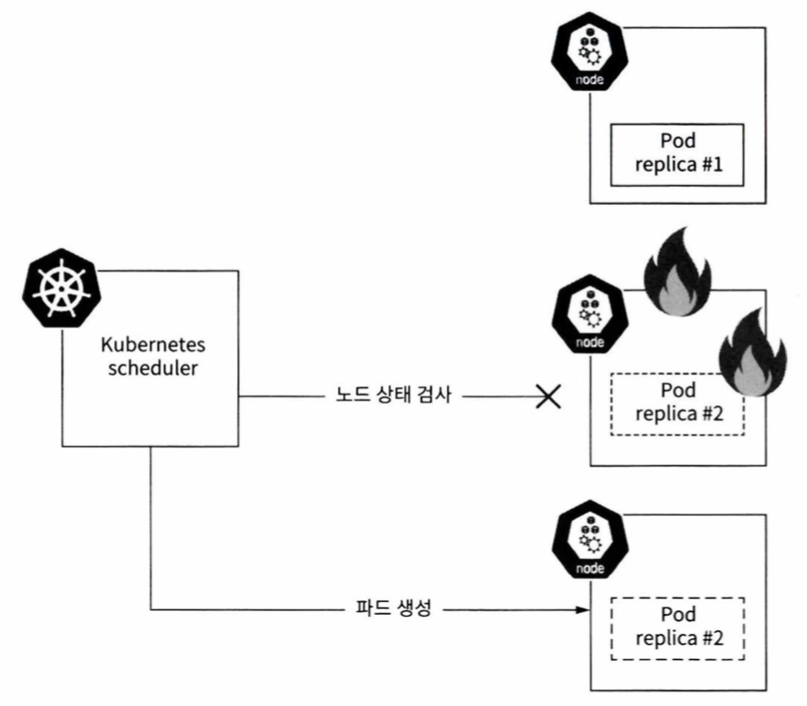
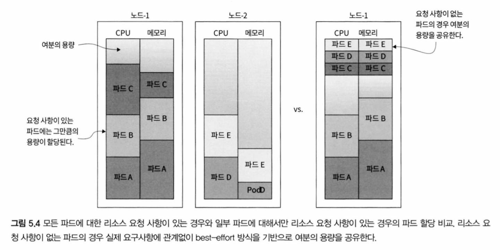
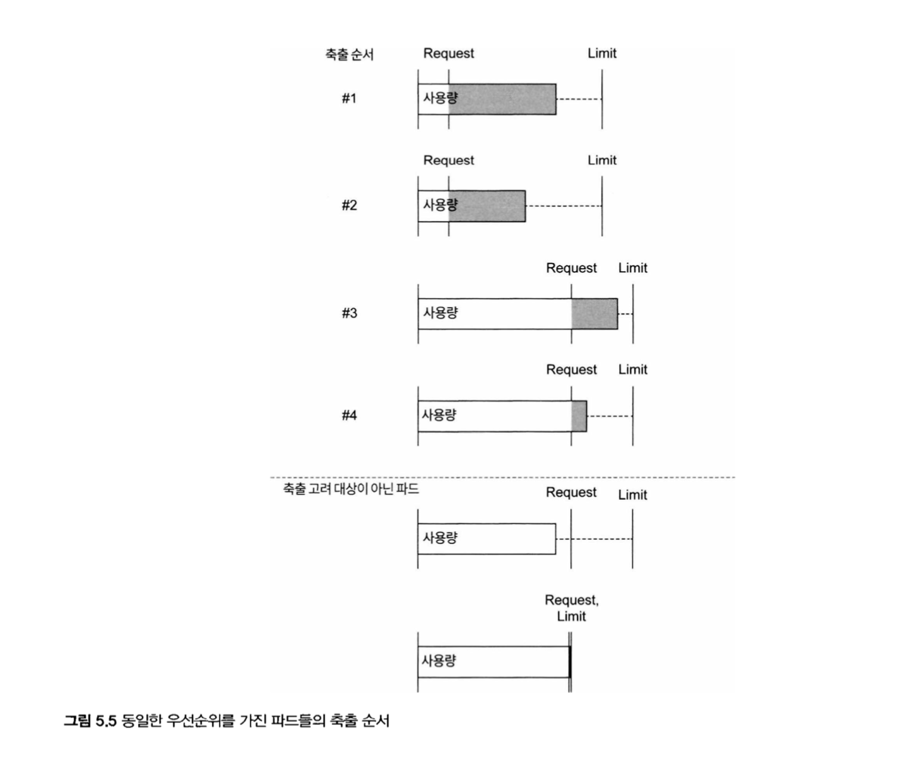
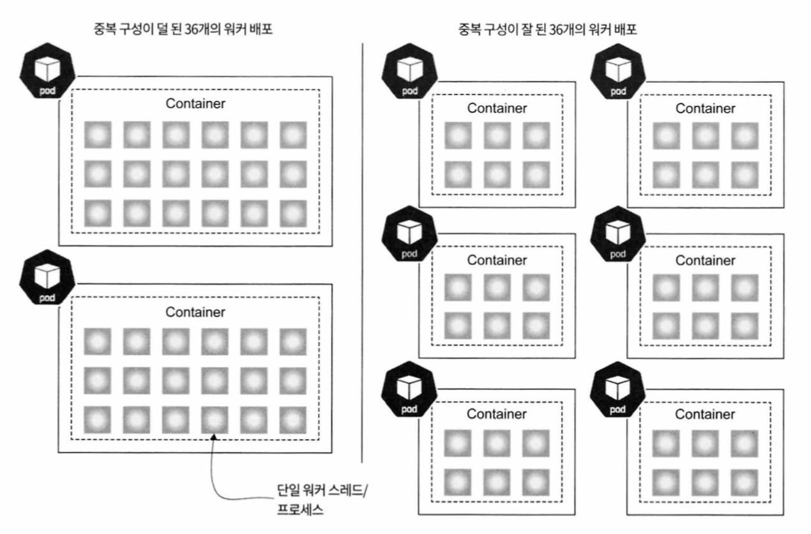

## k8s 스케쥴러의 역할
k8s 스케쥴러는 전체 시스템의 두뇌같은 역할을 수행한다. 파드 생성 요청이 발생했을 때 파드 할당을 위해 클러스터 내에서 적합한 노드를 찾고 파드에서 컨테이너를 부팅하고 실행하는 역할을 수행한다. 그리고 디플로이먼트 등으로 생성된 파드 들이 적절하게 여전히 정상적으로 실행중인지 지속적인 관찰 작업 역시 수행한다. 만약 정상적으로 수행되던 파드가 종료되거나 할 경우 스케쥴러는 새로운 파드를 스케쥴링할 새로운 노드를 찾기위한 시도를 하게 된다.<br/>


<br/>

스케쥴러가 파드를 노드에 배치할 때 스케쥴러는 다각도로 스케쥴링에 대해 고려한다. 이때 스케쥴러는 리소스에 대한 요구사항(Node Selector, Affininty 등)등을 고려해서 클러스터에서 파드가 배치될 올바른 위치를 찾는다. 만약 클러스터에 배치할 수 없는 파드는 Pending 상태로 변경된다.<br/>
<br/>

## resources 속성 명시의 중요성
e.g.
```yaml
apiVersion: apps/v1
kind: Deployment
metadata:
  name: timeserver
spec:
  replicas: 3
  selector:
    matchLabels:
      pod: timeserver-pod
  template:
    metadata:
      labels:
        pod: timeserver-pod
    spec:
      containers:
      - name: timeserver-container
        image: docker.io/wdenniss/timeserver:3
        resources:
          requests:
            cpu: 200m
            memory: 250Mi
```
<br/>

디플로이먼트 매니페스트에 resources 내에 requests 를 명시하면 쿠버네티스의 스케쥴러가 스케쥴링에 대해 판단할수 있는 정보를 제공하게 되어 적절한 노드를 찾는 데에 도움을 준다. 따라서 운영환경에서 배포 시에 이런 정보를 추가해야 한다. 파드에 리소스를 명시하지 않으면 리소스가 랜덤하게 할당된다.<br/>


<br/>

위 그림의 좌측은 리소스를 명시하지 않은 파드 들이 노드에 배치된 모습니다. 리소스를 명시하지 않았기에 랜덤하게 리소스가 할당되었는데, 파드 다섯개가 노드 2개에 배치되었다. 반면 우측의 그림을 보면, 경량의 파드는 초기 파드의 용량이 최소한의 용량으로 시작해 노드에 배치되었는데, 파드 다섯개가 노드 하나에 배치됐다.<br/>
<br/>

파드에 리소스에 대한 명세가 없을 경우 리소스가 부족해지거나 노드에서 사용가능한 것보다 더 많은 메모리를 사용하는 경우 해당 파드가 제거될 수 있다는 점이다. 실제로는 요청하는 리소스를 실제 사용할 양 보다 크게 잡는 경우가 많다(요청한 리소스보다 적은 리소스를 사용하도록 하는 경우가 많다). 이 부분은 requests 를 사용한다. 그런데 파드가 노드의 여유분의 용량을 사용할수 있는 제한치를 설정하면 좋은데 이 것은 limits 를 사용한다. Memory 의 limits 를 초과한 파드는 재시작되며 CPU 의 limits 를 초과한 파드는 강제로 사용량을 낮춘다. 즉, Memory 의 limits 가 부족한 경우가 더 치명적이다.<br/>
<br/>

스케쥴러 입장에서는 파드 들을 스케쥴링하고 노드에 배치할때 파드의 requests(요청 사항) 만을 고려하며, 스케쥴링 시 limits 값은 전혀 고려되지 않는다.<br/>

<br/>

## CPU, Memory 각각의 단위 표현

CPU<br>
'm' 은 'millicore' 를 의미하며 1000m 은 1 cpu 를 의미한다. 따라서 200m 은 0.2 cpu (20%)를 의미한다. 200m 등과 같이 표현해도 되고 'm' 단위 표기 없이 0.2만 표기 시에도 동일하게 인식한다. <br/>
<br/>

Memory<br/>
메모리를 표시하는 단위는 'Mi'(MiB), 'Gi'(GiB) 를 의미하며, Gi의 경우 기가바이트를 의미하며 1024의 거듭제곱형태의 표기단위이며. M,G의 경우 M은 메가비트, G는 기가비트를 의미하는데 M,G의 경우 1000 단위의 거듭제곱형태의 표기단위다.<br/>
<br/>

## 쿠버네티스의 3가지 QoS(Quality of Service) 등급
requests 보다 높은 limits 를 설정하거나 limits 를 전혀 설정하지 않을 경우 새로운 문제가 발생한다. requests 에 정의된 리소스의 사양을 할당받은후 계속해서 리소스를 더 많이 소비하게 되는 경우인데, 다음과 같은 결과로 이르게 된다.
- (1) limits 를 정의했을 때 limits 를 초과하게 되는 경우
- (2) limits 를 정의하지 않았을 때 파드가 노드의 리소스를 잠식하면서 결국 노드의 리소스가 부족해지는 상황이 올 경우

이와 같은 문제를 해결하기 위해 쿠버네티스는 파드에 QoS 등급을 부여해서 순위를 지정해 먼저 제거할 파드를 선택한다. QoS 등급은 아래의 3가지다.
* **Guaranteed:** 모든 컨테이너의 `requests`와 `limits`가 **정확히 일치**할 때.
* **Burstable:** 하나 이상의 컨테이너에서 `limits`가 `requests`보다 **크게 설정**되어 있을 때.
* **BestEffort:** 어떠한 `requests`나 `limits`도 **설정하지 않았을 때**.

<br/>

QoS 등급은 파드를 생성한 후 `kubectl get pod [파드명] -o yaml`을 실행해 보면, 사용자가 작성하지 않았던 `status` 필드 하위에 다음과 같이 자동으로 기록된 것을 확인할수 있다.
```yaml
status:
  qosClass: Burstable  # <-- 쿠버네티스가 자동으로 부여한 값
  phase: Running
```
<br/>

### Guaranteed 클래스
Guaranteed 클래스 등급은 requests, limits 를 동일하게 설정했을 때를 의미한다. 요청한 리소스 만큼을 파드가 사용하도록 보장한다. 만약 파드에 여러 컨테이너가 존재할 경우 모든 컨테이너의 requests, limits 가 동일해야 Guaranteed 클래스로 간주된다. Guaranteed 클래스는 다양한 조건에서 항상 동일한 리소스를 사용할수 있으며 스케쥴링 된 것보다 많은 리소스를 사용하게되지 않기에 노드에서 제거되지 않는다.<br/>
<br/>


### Burstable 클래스
Burstable 클래스 등급은 requests 보다 limits 을 높게 설정한다. 여러 컨테이너로 구성된 파드일 경우 컨테이너 중 하나라도 requests 보다 limits 가 높게 설정되어 있을 경우 해당 파드는 Burstable 클래스로 간주된다. requests 에 명시한 용량을 limits 용량 이하로 늘리는 것을 'Bursting' 또는 '버스트한다.' 라고 표현한다. 이 버스트 기능은 예기치 않은 결과를 만들어낼 수 있기 때문에 Burstable 한 파드를 사용할 때는 주의가 필요하다. Burstable 클래스로 분류된 파드는 리소스 requests 를 초과한 순간 부터는 노드 메모리가 부족했을 때 축출(Eviction) 1순위가 된다. "예약한 것 보다 더 쓰고 있으니 급할 때는 너부터 나가라" 라는 의미로 생각하면 된다.<br/>

e.g.<br/>
파듯 스펙
* `requests`: 500Mi
* `limits`: 1000Mi (Burstable 클래스)

| 현재 메모리 사용량 | 상태 | 노드 리소스 부족 시 운명 |
| :--- | :--- | :--- |
| **300Mi** | `requests`보다 적게 사용 | **매우 안전.** 절대 1순위로 쫓겨나지 않음. |
| **500Mi** | `requests`만큼 사용 | **안전.** 약속된 만큼만 쓰고 있으므로 보호받음. |
| **800Mi** | `requests`를 초과하여 사용 | **위험.** '버스트' 중이므로 노드가 힘들어지면 즉시 쫓겨남. |

<br/>

결국 **"리소스 요청(requests)을 초과하지 않는 한"**이라는 조건은, **"네가 최소한으로 보장받기로 한 선을 넘지 않는다면, BestEffort 파드들이나 다른 욕심쟁이(버스트 중인) 파드들보다 우선적으로 살려주겠다"**는 약속이다. 이 개념은 실무에서 **OOM(Out Of Memory) Killer** 동작과도 직결된다.<br/>
 
* 노드 메모리가 꽉 차면, 커널은 `OOM Score`가 높은 파드를 죽입니다. 
* 쿠버네티스는 `requests`보다 많이 쓰는 파드에게 더 높은 `OOM Score`를 부여하도록 설계되어 있습니다. 


따라서 중요한 서비스라면 `requests` 값을 너무 낮게 잡지 말고, 실제 평균 사용량에 가깝게 설정해야 "축출로부터 안전"해질 수 있다.<br/>
<br/>

### BestEffort 클래스
`requests`, `limits` 를 명시하지 않은 파드는 Best Effort 로 간주된다. 이 경우 쿠버네티스가 원하는 곳으로 스케쥴링된다. 엄청 낮은 수준의 reuqests 를 갖는 Burstable 클래스와 비슷하게 동작한다.


## 추천되는 QoS 설정방식
파드의 안정성을 고려해서 항상 requests 는 싫행할 수 있는 만큼 높은 값으로 설정하고, Best Effort 처럼 requests 를 설정하지 않는 패턴은 지양해야 한다. 우선순위가 높고 중요한 워크로드에 대해서는 성능을 보장하기 위해 requests, limits 에 대한 설정을 해야 한다. Best Effort 와 같은 파드는 리소스 경합이 발생하면 노드에서 가장 먼저 축출(eviction)된다.<br/>
<br/>

## 축출 (Eviction)
메모리 같은 유한한 리소스에 대한 경합이 발생할 때 requests 를 넘어선 리소스를 사용하는 파드에 대해 축출(Eviction)이라는 프로세스를 통해 requests 이상으로 리소스를 사용하는 파드를 제거해서 리소스를 회수한다.<br/>

이렇게 제거된 파드가 디플로이먼트와 같은 워크로드 구성으로 이뤄진 경우에는 스케쥴러에 의해 다시 스케쥴링되는데 일반적으로는 다른 노드에  스케쥴링되게 된다. 하지만 너무 자주 축출(Eviction)이 발생하면 디플로이먼트 자체의 가용성이 줄어들기에 이런 경우에는 해당 디플로이먼트와 파드, 그리고 하위 컨테이너 들에 대해 requests 값을 늘려서 조정한다.<br/>
<br/>

### 스케쥴러의 축출(Eviction)과정
축출(Eviction)할 파드를 찾을 때 쿠버네티스는 requests 를 넘어선 리소스를 사용하는 파드를 우선순위 번호를 부여해 정렬한다. 그리고 requests 를 초과한 리소스들에 대해 얼마 만큼을 requests 를 넘어섰는지를 기준으로 정렬한다. 이때 Best Effort QoS 클래스 파드는 requests 가 설정되지 않았으므로 가장 먼저 축출(Eviction)된다. 만약 우선순위 번호가 같은 파드들이 여러개일 경우 리소스 요청값을 넘어선 만큼의 사용량으로 순위를 매긴다. 여기에 대한 자세한 설명은 다음 그림읓 참조하면 이해가 수월하다.



<br/>


### 축출 오류 상태
파드 상태를 조회시에 `Evicted` 가 표시된다면 이 파드는 요청한 것보다 많은 리소스를 사용하기 때문에 스케쥴러에 의해 축출되었음을 의미한다. 이런 상황은 가끔 발생하는 것은 용납되지만, 자주 발생할 경우 축출(Eviction)이 너무 자주 발생하는 것은 컨테이너에서 요청하는 리소스값과 클라우드의 컴퓨팅 용량을 늘리는 것을 검토해봐야 한다는 것을 의미한다.<br/>
<br/>

## PriorityClass (우선순위)
파드에 대해 0 \~ 1000000000 범위의 정수로 우선순위를 부여할수 있는데 PriorityClass 라는 오브젝트를 통해 정의하고, 이 PriorityClass 를 deployment 또는 pod 스펙에 명시해서 사용한다. 이 우선순위 번호는 스케쥴링 중에도 사용되는데, 스케쥴링을 위해 대기중인 파드가 많은 경우 스케쥴러는 우선순위가 가장 높은 파드를 우선적으로 스케쥴링한다. 우선 순위를 사용해 스케쥴링을 조정하는 것은 특히 어떤 배치 잡(batch job)을 먼저 실행해야 하는지 순위를 지정할 때 유용하다.<br/>
<br/>

e.g. PriorityClass "high-priority"
```yaml
apiVersion: scheduling.k8s.io/v1
kind: PriorityClass
metadata:
  name: high-priority
value: 1000000
preemptionPolicy: Never    # 우선순위 클래스는 클러스터에 사용 가능한 용량이 없는 경우 우선순위가 낮은 파드를 제거하지 않음
globalDefault: false       # 우선순위 클래스가 기본값인지 여부를 설정
description: "Critical services."
```
<br/>

`high-priority` 라는 이름의 PriorityClass 를 `1000000` 의 우선순위를 갖도록 정의했다. `preemptionPolicy: Never` 는 우선순위가 높은 파드가 스케쥴링 되지 않는 경우 우선순위가 낮은 파드를 제거하지 않도록 설정한다. `globalDefault: false` 는 우선순위 클래스가 기본값인지 여부를 설정한다.<br/> 
<br/>

e.g. Deployment "timeserver"
```yaml
apiVersion: apps/v1
kind: Deployment
metadata:
  name: timeserver
spec:
  replicas: 3
  selector:
    matchLabels:
      pod: timeserver-pod
  template:
    metadata:
      labels:
        pod: timeserver-pod
    spec:
      priorityClassName: high-priority    # 해당 디플로이먼트에 사용할 우선순위 클래스
      containers:
      - name: timeserver-container
        image: docker.io/wdenniss/timeserver:3
        resources:
          requests:
            cpu: 200m
            memory: 250Mi
```
<br/>

위에서 정의한 `high-priority` 라는 PriorityClass 를 `timeserver` 라는 디플로이먼트에 적용했다.<br/>
<br/>


## 선점 (Preemption)
PriorityClass 에 우선순위를 매기면 중요한 워크로드 순으로 먼저 스케쥴링되도록 할수 있다. 하지만 클러스터에 일정기간 동안 리소스가 충분하지 않아서 우선순위가 높은 파드가 Pending 상태에 빠져있고 우선순위가 낮은 파드는 이미 실행중인 경우가 발생할 수 있다. 즉, 이미 실행중인 워크로드 중 우선순위가 낮은 파드는 정상운영되어 있지만 클러스터 노드의 리소스가 충분하지 않은 경우다. 이 경우 용량이 확보될 때까지 기다리기보다 우선순위가 높은 워크로드가 우선순위가 낮은 워크로드를 밀어내고 실행되게 할수 있는데 이를 선점(Preemption)이라고 한다. PriorityClass 의 preemptionPolicy 를 PreemptLowerPriority 로 설정하면 선점(Preemption)이 발생한다. <br/>

만약 PriorityClass 의 preemptionPolicy 를 Never 로 설정하면 선점(Preemption)이 발생하지 않는다. PriorityClass 의 preemptionPolicy 는 기본값으로 "PreemptLowerPriority" 이다.<br/>
<br/>

e.g. 
```yaml
apiVersion: scheduling.k8s.io/v1
kind: PriorityClass
metadata:
  name: high-priority-preemption
value: 1000000
preemptionPolicy: PreemptLowerPriority    # 이 우선순위 클래스는 클러스터에 사용 가능한 용량이 없는 경우 우선순위가 낮은 파드를 제거한다.
globalDefault: false
description: "Critical services."
```
<br/>

### preemptionPolicy (gemini)
Edited content.md
Searched web: "kubernetes PriorityClass preemptionPolicy values"

쿠버네티스의 `PriorityClass` 리소스에서 `preemptionPolicy` 필드에 지정할 수 있는 속성은 다음 두 가지입니다.

1. **`PreemptLowerPriority` (기본값)**
   - **동작**: 이 정책이 설정된 파드는 노드에 리소스가 부족할 경우, 자신보다 우선순위가 낮은 파드를 **밀어내고(Preemption)** 그 자리를 차지할 수 있습니다.
   - **특징**: 중요한 워크로드가 즉시 실행되어야 할 때 사용합니다.

2. **`Never`**
   - **동작**: 이 정책이 설정된 파드는 **비선점형(Non-preempting)** 파드가 됩니다. 즉, 우선순위가 낮은 파드가 이미 실행 중이더라도 그 파드를 밀어내지 않습니다.
   - **특징**: 스케줄링 대기열(Queue)에서는 다른 낮은 우선순위 파드보다 앞서 배치되지만, 기존 파드를 강제로 제거하지는 않습니다. 리소스가 자연스럽게 확보될 때까지 대기합니다. 주로 우선순위는 높지만 다른 워크로드의 중단을 원치 않는 작업(예: 데이터 백업 등)에 사용됩니다.

**요약 비교:**

| 속성 | 선점 여부 | 특징 |
| :--- | :--- | :--- |
| **`PreemptLowerPriority`** | **YES** | 낮은 순위 파드를 밀어냄 (최우선 실행 보장) |
| **`Never`** | **NO** | 대기열에서만 우선순위 적용 (기존 파드 보호) |

<br/>

## 우선순위,선점을 사용해야 하는 시점
우선순위,선점은 쿠버네티스의 유용한 기능이다. 따라서 이 속성이 축출(Eviction), 스케쥴링에 미치는 영향은 이해하고 있는 것이 좋다. 모든 디플로이먼트에 우선순위를 지정하는 데에 너무 많은 소비하기 전에 requests, limits 설정이 올바른지부터 점검하고 확인하는 것이 가장 중요하다.<br/>
<br/>

## 파드 리소스 계산하기
가장 최적으로 설정된 값은 '파드를 실행하고 관찰하는 것'을 통해 찾을 수 있다. 우선 requests 가 좀 과하다 싶을 정도로 파드에 과한 용량을 부여하는 것으로 시작하고, 파드의 실제 사용량을 관찰하면서 requests 값을 재조정해가면서 최적의 값을 찾아야 한다. 

```yaml
apiVersion: apps/v1
kind: Deployment
metadata:
  name: timeserver
spec:
  replicas: 1    # 부하 테스트를 위해 복제본의 수를 1로 설정함
  selector:
    matchLabels:
      pod: timeserver-pod
  template:
    metadata:
      labels:
        pod: timeserver-pod
    spec:
      containers:
      - name: timeserver-container
        image: docker.io/wdenniss/timeserver:3
        resources:    # 테스트 중인 파드. 사용량을 분석할 수 있도록 리소스 제한값이 설정돼 있지 않음.
          requests:
            cpu: 200m
            memory: 250Mi
```
<br/>

- limits : 파드에 필요한 리소스의 양을 확실히 알기 전까지는 limits(제한값)을 설정하지 않는 것이 좋다.
- requests : 파드에 필요한 리소스의 양 보다 큰 용량을 지정하고 필요에 의해 조정을 하며 최적값을 찾는다. 한번 정의 후 조정이 아예 없지 않다. 애플리케이션의 변경사항에 따라 자주 변경될 수 있다.

### request 의 양 추정방식
kubectl top pods 명령을 실행하고 시작 리소스 사용량, 특히 메모리 사용량을 기록해둔다. Burstable QoS 를 사용하기로 선택했을 경우 파드를 부팅하는 데에 필요한 리소스에 대해 스냅샷을 기록해두면 request 를 지정시에 어느 정도의 양을 지정할지 가늠할수 있게 된다.<br/>

이때 request 를 유발시키는 라이브러리나 오픈소스를 사용하면 좋은데 k6, Locust, Apache 벤치 등이  있다. 책에서는 Apache 벤치를 사용하는데, 로드 테스팅 도구에 대해서는 하단의 '로드 테스팅 도구들' 섹션에 별도로 정리해두었다. 로드 테스팅 도구로 부하를 유발시켜 테스트는 예를 들면 다음 과 같은 방식으로 수행할 수 있다.<br/>
<br/>

e.g.
- 20개의 스레드를 사용해 총 10000개의 요청을 생성하는 등의 테스트를 수행한 후 kubectl top pods 를 통해 파드의 리소스 사용량을 시작 시, 보통의 부하발생시, 높은 부하 발생시, 부팅 후 1시간 후, 부팅 후 1일 후 를 각각 기록해두고 판단한다.

<br/>

파드 로드된 상태에서는 다음의 요소들을 체크해서 기준이 될만한 것들을 남겨둔다.
- 시작 시
- 보통의 부하발생시
- 높은 부하 발생시
- 부팅 후 1시간 후
- 부팅 후 1일 후

<br/>

예를 들어 다음과 같은 데이터를 확보해둔다면, 추후 requests 를 설정할 때 참고할 수 있다.<br/>
<br/>

**테스트 과정에서 메모리 및 CPU 사용량**

| 테스트 시점 | CPU(cores) | Memory(bytes) |
| :--- | :--- | :--- |
| 시작 시 | 20m | 200Mi |
| 보통의 부하 발생 시 | 200m | 400Mi |
| 높은 부하 발생 시 | 850m | 503Mi |
| 부팅 후 1시간 후 | 210m | 505Mi |
| 부팅 후 1일 후 | 200m | 600Mi |

<br/>

표를 보면 메모리 사용량의 하한은 400MiB 로 추정하는 것이 합리적이다. CPU 사용량의 하한은 200m 로 추정하는 것이 합리적이다. 시작 시에는 얼마 되지 않는 리소스가 사용되지만 이 것을 하한값으로 지정할 경우 requests 를 빠르게 넘어서서 축출대상에 포함되는 조건에 더 가까워질수 있기 때문에 시작 시의 데이터 보다는 보통의 부하 발생 시의 데이터를 기준으로 삼는 것이 좋다.<br/>

현재 우리는 보통의 부하 발생시 400MiB 를 사용한다는 것을 알고 있다. 그런데 만약 Memory 의 limits 값을 400MiB 보다 낮게 설정할 경우 파드에서 OOMKilled(메모리 부족으로 종료)가 발생할 수 있다. 반면 Memory 의 limits 값을 높게 설정하면 메모리 부족현상은 발생하지 않을 수 있지만, 노드 내에 다른 리소스에 의해 여유 용량이 모두 소진될 경우 추가 메모리를 확보하지 못하게 된다는 단점이 있다. 즉, Memory 의 limits 를 높게 잡으면 정말로 필요할 때 노드 내에 리소스가 부족해서 파드가 축출될 가능성이 높아진다.<br/>

그렇다면 requests 로 400MiB 를 잡는 것은 올바른 requests 값일까? 아니다. 이유는 다음과 같다.<br/>
- 메모리 용량 산정시 10% 정도의 버퍼가 필요하다.
- 1시간 후에 모모리 사용량이 505MiB 정도인 것을 확인했다. 즉 505MiB 정도가 하한으로 설정하기 좋은 시작점이 될수 있다.

부팅후 하루가 지난 시점의 메모리 사용량인 600MiB 는 올바른 Memory Requests 값일까? 아니다. 이와 같은 현상은 메모리 누수로 발생했을 가능성이 크다. 메모리 제한값을 높게 설정하면 파드가 하루 종일 실행되는 것을 보장할 수 있다. 하지만 메모리 회수를 위해 하루가 지나면 해당 시스템을 재부팅하는 것이 바람직하다. 쿠버네티스는 충돌이 발생한 컨테이너를 자동으로 재시작하기에 하루 뒤에 OOM이 발생하면 해당 컨테이너를 재시작한다.<br/>

인스타그램은 CPU 성능 10% 향상을 위해 파이썬의 가비지 컬렉션을 비활성화 한 것으로 유명하다. 모든 것이 자동으로 운영되고 수천 개의 복제본이 있다면 시간이 지나면서 프로세스가 비대해지고 재부팅되는 것이 크게 문제가 되지 않는 것으로 판단한 것이다. 사전 조사를 철저히 하지 않았다면 권장되지는 않지만, 미리 철저하게 조사가 되어 있다면 애플리케이션에서 발생하는 메모리 누수의 속도가 완만하게 느리게 증가한다면 수정해야 할 최우선 버그라고 보기 보다는 부팅한지 오래된 파드에 대해 메모리의 제한값을 넘어설 경우 재부팅을 통해 새로운 파드로 교체하는 전략을 사용하는 것도 나쁘지 않는 판단이다.<br/>

참고
- [Dismissing Python Garbage Collection at Instagram](https://instagram-engineering.com/dismissing-python-garbage-collection-at-instagram-4dca40b29172)

<br/>

이제 최적의 requests 값을 찾아보자. 부팅 후 1시간 후에는 505MiB가 소모된다. 그리고 여기에 최소 10% 의 버퍼를 부여하겠다는 원칙을 세운다. 최소 10% 라는 것은 주관적인 기준이며 제품의 특성에 따라 다르게 부여할수 있다. 최소 10% 의 버퍼를 추가할 경우  505MiB * 1.1 을 통해 555MiB 라는 값을 얻게 된다. 이렇게 약간의 여유를 버퍼로 가진 requests 값을 부여하는 것이 중요하고 하한값은 보통의 부하 발생시 보다는 부팅후 1시간 및 5시간까지의 메모리 값을 통해 적절한 여유있게 높은 하한값을 설정하는 것이 좋다. 그렇지 않으면 잦은 축출(Eviction)이 발생하게 된다.<br/>
<br/>

limits 값은 어떻게 설정해야할까? 1일동안 모니터링 한 값보다 너무 높게는 설정하지 말고, 하루 지났을때에 필요한 메모리 보다 과도하게 높게 설정(e.g. 2배 이상)하지는 말고 1일 동안 모니터링 한 값에 약간의 추가버퍼를 설정해서 지정하는 것이 좋다. 메모리 누수가 일정 기간내에 완만하게 증가해서 도달했을 경우 메모리를 과도하게 소비하게 허용해서 과도한 리소스를 소모하는 것 보다 시스템이 파드를 재시작시키는 것이 더 효율적이다. 대안으로는 Guaranted QoS 처럼 requests 와 limits 값을 동일하게 설정하는 것이다.이 방식은 실행중인 파드에 관계 없이 파드에게 지속적인 성능을 제공하게 된다. 만약 이렇게 Guaranted QoS 를 사용한다면 requests 를 여유있게 높게 설정하는 것이 좋다.<br/>
<br/>

## 리소스 부족 시 CPU, Memory 의 차이점
- CPU 는 노드 내에 리소스가 부족할 경우 성능저하는 발생하지만, OOM Error 가 발생한다거나 재부팅이 발생하지는 않는다.
- Memory 는 노드 내에 리소스가 부족할 경우 추가 용량을 얻는데에 실패할 경우 OOM Error 가 발생하며 충돌이 발생한다.

CPU 는 압축가능(compressible)한 리소스다. 애플리케이션이 필요한 CPU 리소스를 모두 확보하지 못하면 애플리케이션의 실행속도가 느려진다. 반면 메모리는 압축불가능(incompressible)한 리소스다. 애플리케이션이 필요한 메모리 리소스를 모두 확보하지 못하면 애플리케이션의 실행이 중단된다.<br/>


## CPU 의 requests, limits 설정에 관해
CPU 는 압축가능한 리소스이기에 메모리보다 더 여유있게 requests, limits 값을 설정할 수 있다. 다만 여기에 Burstable 하게 할지 Guaranteed 하게 사용할지에 대해서는 애플리케이션의 특성에 따라 다르게 설정해야 한다. Burstable 하게 설정할 경우에는 예기치 못한 트래픽 급증으로 인한 CPU 사용량의 급증에 대응할 수는 있지만, 노드에서 사용하지 않는 용량을 모두 다 써서 다른 파드들이 추가로 확보해야 할 CPU 를 모두 뺏어가게 될 수도 있다. 만약 이때 점유한 리소스가 반납이 되지 않은채로 오랜 시간이 지난다면 다른 파드들의 CPU 성능이 낮아질수 있다. 반면 Guaranteed 로 설정할 경우에는 requests 와 limits 를 동일하게 설정하면, 정량적으로 일정한 처리 성능이 부족할 경우 스케일아웃이 이뤄지도록 보장할 수 있게 된다.<br/>
<br/>

## CPU 오버커밋 방식을 통해 비용절감
Burst 가 자주 발생하는 워크로드일 경우 CPU 오버커밋 방식이 바람직한 전략이 될 수 있다. CPU 오버커밋 방식은 CPU 요청값을 낮게 설정(파드에 실제로 필요한 것 보다 낮은값을 설정)해서 CPU 요청 값을 실제 사용량으로 설정할 때보다 많은 파드를 노드에 배치하는 전략이다.<br/>

트래픽의 양이 적은 수백개의 웹사이트를 호스팅하는 경우를 예를 들어보자. 각 애플리케이션은 한 시간에 단 몇개의 요청만을 수신 가능하며 해당 시간 동안에만 CPU 리소스가 필요하다. 이런 경우 각 애플리케이션의 CPU 요청(requests) 값은 50m (1개의 core 당 20개의 파드가 스케쥴링 가능), 제한(limits) 값은 1000m(일시적으로 전체 코어 사용가능)일 수 있다.<br/>

이런 오버커밋 전략을 사용하는 케이스는 동일 머신에서 실행 중인 다른 파드 들이 상당 시간 유휴시간일 경우에 이런 오버커밋 전략을 사용하는 것이 효율적이다. 즉 노드 내에서 Burst 가 이뤄질 때 다른 리소스들이 유휴상태여서 추가 리소스를 확보 가능한 케이스여야 한다는 의미다. 하지만 노드 내의 모든 파다의 컨테이너 들을 동시에 버스트해야 할 경우 성능 저하가 발생할 수 있다.<br/>

**가장 안전한 접근 방식은 오버커밋을 전혀 하지 않는 것**이다. 운영 시에 예외적으로 어떤 리소스에만 타협점을 준다면 특정 파드에만 오버커밋을 적용하는 것도 가능하다. 파드에 약간의 추가 CPU 를 제공하면 지연 시간을 줄이는 데에 도움이 될 수 있다. 하지만 이런 초과 용량 설정에 의존하기보다는 합리적으로 기본 부하를 처리할수 있을 정도의 CPU 리소스에 대한 요청값을 어느 정도 높게 설정하는 것이 낫다.<br/>

내 생각은 이렇다. CPU 오버커밋은 어느 정도는 '트릭'이고 정석적인 부분은 아니어서 오히려 해결이 쉽지 않은 케이스가 발생할 수 있다고 생각했다. CPU 의 requests 를 어느 정도 필요한 것보다 낫게 설정해서 더 많은 파드개수가 뜨도록 하는 걸 의미하는데, 이렇게 하기보다는 정량적으로 리소스를 확보해서 계획하는 것이 나아보인다.<br/>


## 파드의 복제본 개수 vs 동시성 효율
복제본 수(파드 수)를 늘릴 것인지 vs 스레드 수를 늘릴 것인지 에 대한 주제다.


왼쪽 케이스의 경우 18개의 워커 스레드로 동작하는 파드 2개가 기동중이다. 이 경우 파드 1개 내에서 충돌이 발생해서 파드가 재시작되어야 할 경우 노드의 용량의 절반 가까이가 오프라인 상태가 되어 용량을 효율적으로 사용하지 못하게 된다.<br/>

오른쪽 케이스의 경우 6개의 워커 스레드로 파드 하나를 구성했고, 6개의 파드를 구동하고 있다. 이 경우 1개의 파드가 충돌이 발생해 재시작해야 할 경우 노드의 용량의 1/6만 오프라인 상태가 되어 왼쪽 케이스에 비해 용량을 효율적으로 사용 할 수 있다.<br/>

스레드 수와 복제본 수와의 조화를 고려할 때 전체 워커 스레드의 수를 몇개로 할지 부터 정의한다. 위의 예제에서는 36개의 워커스레드를 전체 복제본 내에서의 최대치로 라고 가정했다. 이때 워커 스레드 중 몇 % 의 워커 스레드가 오프라인 상태가 되어도 서비스에 지장이 없을지를 고려한다. 만약 36 개의 워커 스레드 중 16% 가 오프라인 상태로 변경되어도 서비스에 영향이 없을 것이라고 가정한다면 단일 파드에 배포할 수 있는 최대 워커의 수는 6개(=16%)가 된다. (36 * 0.16 = 5.76, 반올림해서 6개)<br/>

파드에 복제본이 많을 수록 설계는 안전해지지만, 리소스 사용측면에서는 효율이 떨어진다. 따라서 가용성과 리소스 요구사항 사이에 균형을 맞춰야 한다.<br/>

스레드 역시 하나의 애플리케이션에 많은 스레드로 도배를 할 경우 이 경우 역시 문제가 발생한다. 스레드는 프로세스에 비해 애플리케이션 내부에서 실행되며 에러를 찾기 쉽지가 않기 때문에, 신뢰성이 필요한 트랜잭션에 워커스레드를 적용한다던가 하는 선택을 할 경우 복구가 쉽지 않고 장애로 인해 애플리케이션 내의 다른 워커 스레드 들도 동작하지 않는 현상까지 발생할 수 있다.<br/>
<br/>


## 인프라 레벨에서의 가용성 확보
가용성을 높이는 또 다른 중요한 방법은 파드를 최대한 여러 노드에 걸쳐 분산시키는 것이다. 여러 복제본을 가지도록 설계하더라도 모든 복제본이 하나의 노드에서 실행될 경우 해당 노드가 문제가 생기면, 전체 서비스가 위험한 상태에 빠지게 된다. 다행히 GKE, EKS 등의 쿠버네티스 플랫폼들은 파드를 가능한 모든 노드와 여러 존으로 분산시키는 정책을 지원한다. 이 설정을 통해 인프라 레벨에서의 가용성 역시 확보해야 한다.<br/>
<br/>

## 로드 테스팅 도구들
로드테스팅(부하 테스트) 오픈소스 도구는 각자의 철학과 사용하는 언어에 따라 크게 4가지 대장주가 있습니다. 현재 2026년 기준으로 가장 많이 쓰이는 도구들을 특징별로 정리해 드릴게요.

교재('참고자료'섹션 참고)에서는 apahace 의 테스트 도구를 설명하고 있다.
- https://httpd.apache.org/docs/2.4/install.html

<br/>

---

### 1. 대표적인 오픈소스 도구 4대장

| 도구명 | 주력 언어 | 특징 | 추천 상황 |
| :--- | :--- | :--- | :--- |
| **k6** | JavaScript / Go | 성능이 매우 뛰어나고 개발자 친화적임. Grafana와 통합이 잘 됨. | CI/CD 파이프라인 통합, 현대적인 API 테스트 |
| **JMeter** | Java (GUI 기반) | 가장 오래된 표준. 다양한 프로토콜(HTTP, DB, FTP 등) 지원. | 복잡한 시나리오, 레거시 시스템, GUI 환경 선호 시 |
| **Locust** | Python | 파이썬 코드로 시나리오 작성. 분산 테스트(여러 대의 장비로 부하 분산)가 매우 쉬움. | 파이썬 숙련자가 많을 때, 수만 명의 동시 접속자 테스트 |
| **Gatling** | Scala / Java / JS | 높은 처리량, 아카 Akka 기반 비동기 모델. 리포트(차트)가 예쁘기로 유명함. | 대규모 트래픽 처리가 필요하고 고품질 리포트가 중요할 때 |

---

### 2. 도구별 상세 분석

#### **k6 (Grafana k6)**
최근 가장 핫한 도구입니다. 엔진은 Go로 작성되어 가볍고 빠르지만, 사용자는 익숙한 JavaScript로 스크립트를 짭니다.
* **장점:** YAML이나 GUI가 아닌 '코드' 중심이라 Git으로 관리하기 편합니다.
* **이미지:** 

#### **Apache JMeter**
"부하 테스트계의 엑셀" 같은 존재입니다.
* **장점:** 플러그인이 엄청나게 많아서 못 하는 게 없습니다. JDBC를 이용한 DB 부하 테스트도 기본입니다.
* **단점:** XML 기반의 설정 파일이 복잡하고, 많은 부하를 일으킬 때 메모리를 많이 잡아먹습니다.

#### **Locust**
"Test as Code"의 정석입니다.
* **장점:** `locustfile.py` 하나만 작성하면 끝입니다. 웹 UI가 기본 내장되어 있어 실시간으로 그래프를 보기 좋습니다.
* **단점:** 파이썬의 성능 한계 때문에 아주 정밀한 타이밍 제어는 k6나 Gatling에 비해 밀릴 수 있습니다.

#### **Gatling**
성능 면에서는 최강자 중 하나입니다.
* **장점:** 비동기(Asynchronous) 방식으로 동작하므로 적은 사양의 컴퓨터로도 엄청난 양의 가상 유저(Virtual User)를 만들어낼 수 있습니다.
* **단점:** 스칼라(Scala) 언어 장벽이 있었으나, 최근 Java와 JavaScript/TypeScript를 지원하며 접근성이 좋아졌습니다.

---

### 3. 어떤 것을 선택해야 할까요?

* **"나는 개발자고 코드로 관리하고 싶다"** → **k6** 추천
* **"우리 팀은 파이썬을 잘한다"** → **Locust** 추천
* **"복잡한 프로토콜(DB, 메일 등)을 다 테스트해야 한다"** → **JMeter** 추천
* **"최소한의 장비로 최대한의 부하를 쏟아붓고 싶다"** → **Gatling** 추천

혹시 현재 준비 중인 프로젝트의 주력 언어나, 예상되는 동시 접속자 수준이 어느 정도인가요? 상황에 맞춰 더 구체적으로 추천해 드릴 수 있습니다.


## 참고자료
- 개발자를 위한 쉬운 쿠버네티스 : https://product.kyobobook.co.kr/detail/S000216089391
